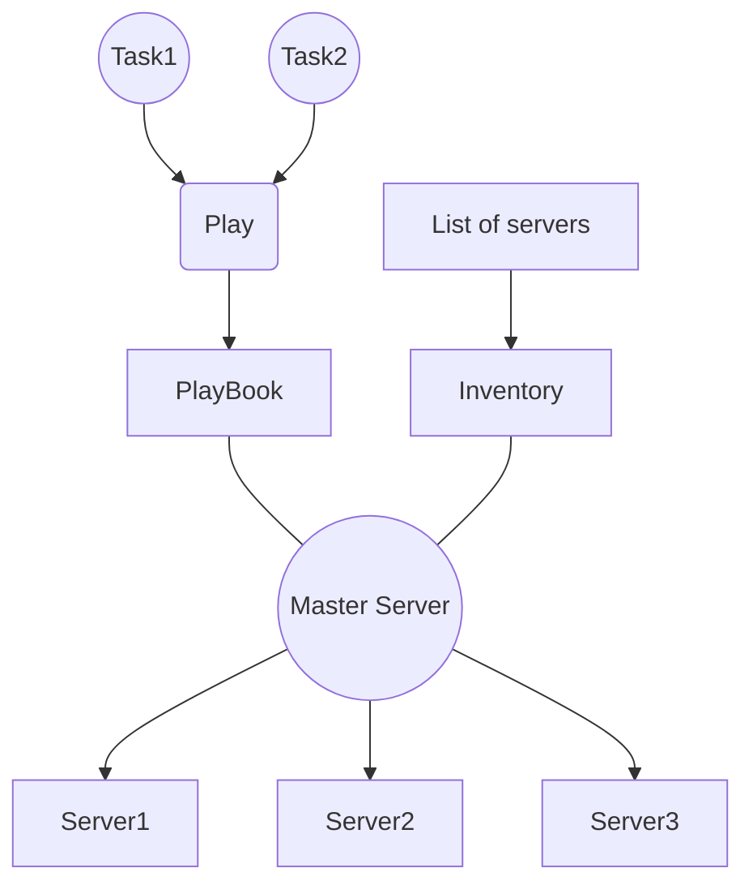

# Udemy Ansible for an absolute beginner

## 2-Overview of Devops

**What are three primary areas of DevOps?**

* Infrastructure automation
* Continuous delivery
* Site reliability engineering  
operate your system, monitor and orchestrate them, desing them for operabiltiy ate the first place.

## 3-Basics of Configuration management

**What is Configuration management? What are its goals**  
Automated method of maintaining the state fo computer systems and software's.

* Maintain the konwn states
* describe the desired state of the system
* use automation

**What are three well-known configuration management tools?**

* Ansible
* Chef
* Puppet

## 4-Pull based vs push based configuration management architecture

**Which CM tools are pull based and which si push based? What are the benefits of each architecture?**

* Chef & Puppet are pull based
* Ansible is push based

Pull based is more scaleable but you need to insall Agent.
Push based is more easier to deploy but difficult to scale.

## 5-Ansible A birdseye view

**What are some features of ansible?**

* agentless
* SSH
* push-based
* python built

**What are ansible components?**



## 6- Overview of YAML

**What are rules of YAML?**

* end in .yaml
* case sensitive
* not use tab

**How declare start of a yaml file?**  
`---`

**How comment in yaml file?**  
`#`  

**ٌWhat is scalar?**
A variable. Placeholder that stores some information.

**Sequence?**  
List  
determeined by `-`
Nested sequence created by spase. like this:

```yaml
- toy
 - car
 - plane
```

**mapping?**  
key value pair

**What are data types in YAML?**

* key value pair
* list: oredered
* dictioneries: unordered
  
## Variables

**What is jinja2 Templating?**  
replacing a varialbe with {{varname}} and defining the value in another file live variable.yaml
remember to put the variable between quotes when it is not between a sentence.

## Conditionals

**How can we use "when"?**  
by adding 'when:' following by a condition using == in the end of a task.
We can use "or" & "and" for conditions combination.

**How can we use loop in conditions?**  
By adding "loop:" followed by the variable name.

**How can we use conditonals by output of previous task?**  
By using `register:` in the first task and when in the second task.

## Loops

**How can we use loop?**  
by adding items after loop: in a array of dictionories(or values) and passing them in item.name format.  

**What is with_?**  
a lookup plugins.  
custom scritp to do specific tasks like connect to other systems.
e.g.

* with_items
* with_k8s
**Question?**  
**Question?**  
**Question?**  
