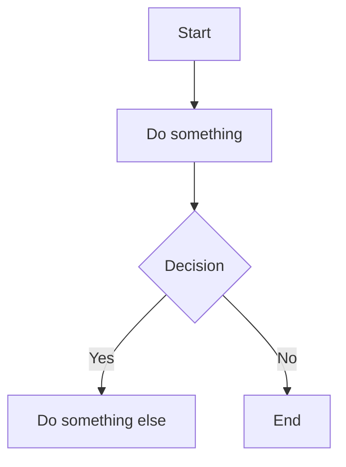

# Udemy Ansible for an absolute beginner

## 2-Overview of Devops

**What are three primary areas of DevOps?**

* Infrastructure automation
* Continuous delivery
* Site reliability engineering  
operate your system, monitor and orchestrate them, desing them for operabiltiy ate the first place.

## 3-Basics of Configuration management

**What is Configuration management? What are its goals**  
Automated method of maintaining the state fo computer systems and software's.

* Maintain the konwn states
* describe the desired state of the system
* use automation

**What are three well-known configuration management tools?**

* Ansible
* Chef
* Puppet

## 4-Pull based vs push based configuration management architecture

**Which CM tools are pull based and which si push based? What are the benefits of each architecture?**

* Chef & Puppet are pull based
* Ansible is push based

Pull based is more scaleable but you need to insall Agent.
Push based is more easier to deploy but difficult to scale.

## 5-Ansible A birdseye view

**Question?** 

**Question?** 

**Question?** 
**Question?** 
**Question?** 
**Question?** 
**Question?** 
**Question?** 

